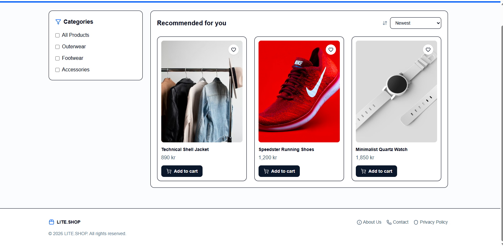

# React Workshop Project

## 📌 Project Overview
This project is a simple e-commerce UI built using React, Vite, TypeScript, and Tailwind CSS.  
The goal of this workshop is to understand component-based structure and props in React.

---

## 🧩 Components

The application is divided into the following components:

- Header
- Sidebar
- ProductGrid
- ProductCard
- Footer

---

## Purpose of each component
- Header: shows logo, navigation, search, and action icons
- Sidebar: shows filters and categories
- ProductGrid: displays multiple products
- ProductCard: displays one product
- Footer: shows footer links and brand info

## 🔗 Props Usage

Props are used to pass data between components.

- App → Header (brand)
- App → Footer (brand)
- App → ProductGrid (products array)
- ProductGrid → ProductCard (title, price, image)

---

## ❓ Why Props?

Props are used to:
- Pass data between components
- Make components reusable
- Keep code clean and organized

---

## ⚙️ Technologies

- React
- Vite
- TypeScript
- Tailwind CSS

---

## 🚀 Run the Project
